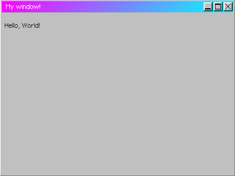

# Getting Started
Welcome to this tutorial! To get started, let's create a window:
## Creating a window
In order to create a window, we use the `$window` global function.
### Code
```javascript
$window({
    title: "My window!", // Name of the window
    html: "<p>Hello, World!</p>" // The HTML string of the window
})
```
<sub>For all window creation options, see [WindowOptions](/api/interfaces/WindowOptions.md). Note that you don't need to put every option.</sub>

### Screenshot


*The window that should appear when you run the above code.*
### What's next
Now that you've created a basic window, we can get into slightly more complex things, such as customization!