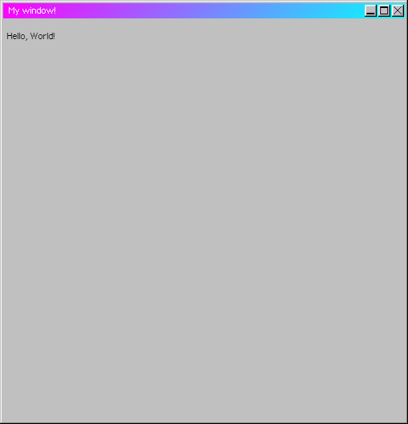

# Customizing your Window
Now that we've created a basic window, let's customize it!
## Sizing
Adding onto the regular `title` and `html` properties, we can use `width` and `height` to set the dimensions of the window.
### Code
```javascript
$window({
    title: "My window!",
    html: "<p>Hello, World!</p>",
    width: 500, // Setting the window body's default width to 500
    height: 500, // Setting the window body's default height to 500
})
```
### Screenshot


*The window that should appear when you run the above code.*
#### Shouldn't it look square?
When using the `width` and `height` properties, the <strong>body</strong> of the window is resized, not the window itself. Additionally, the padding also makes it appear slightly less square as well.